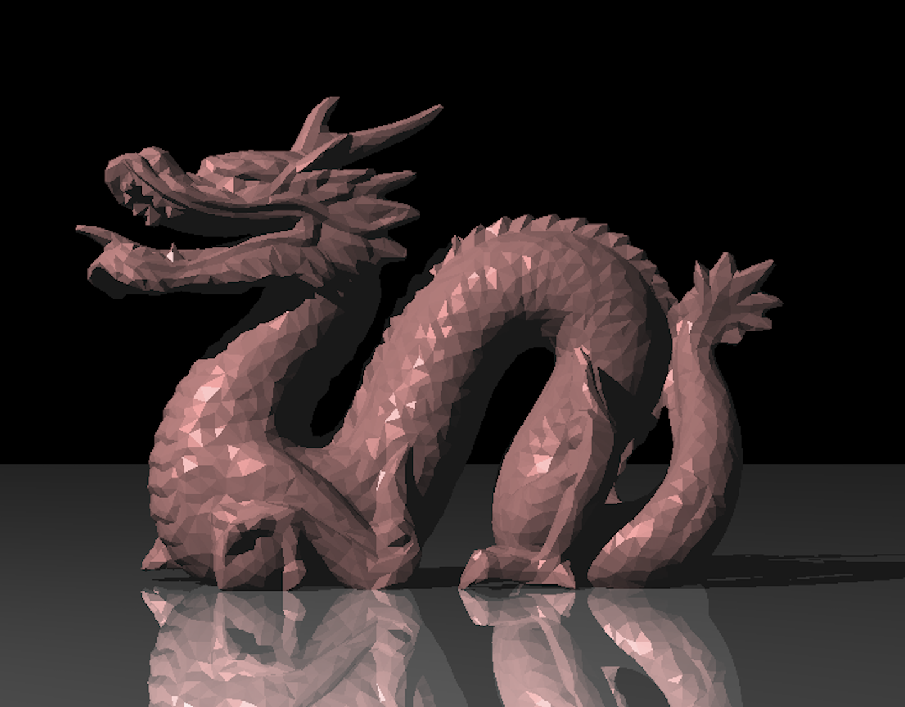
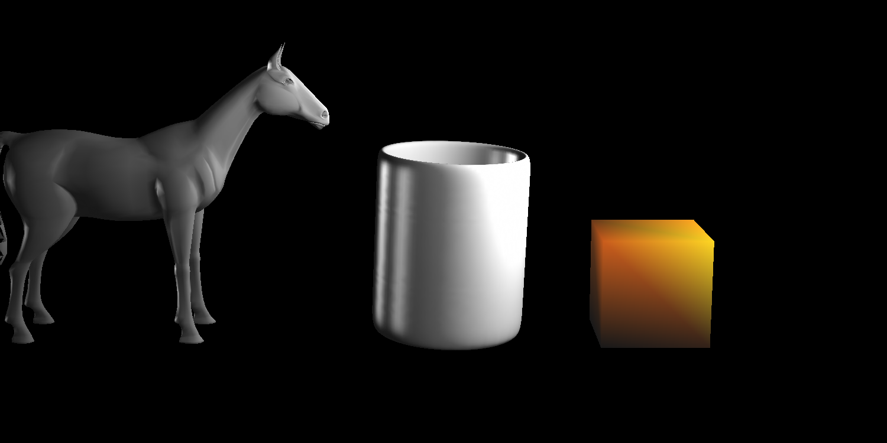
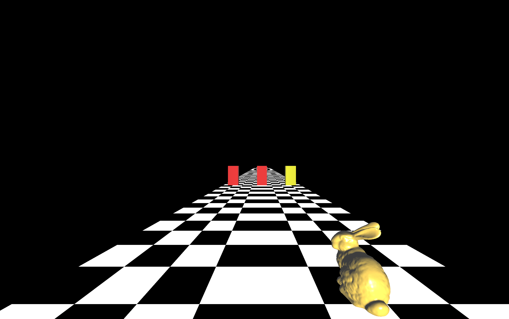
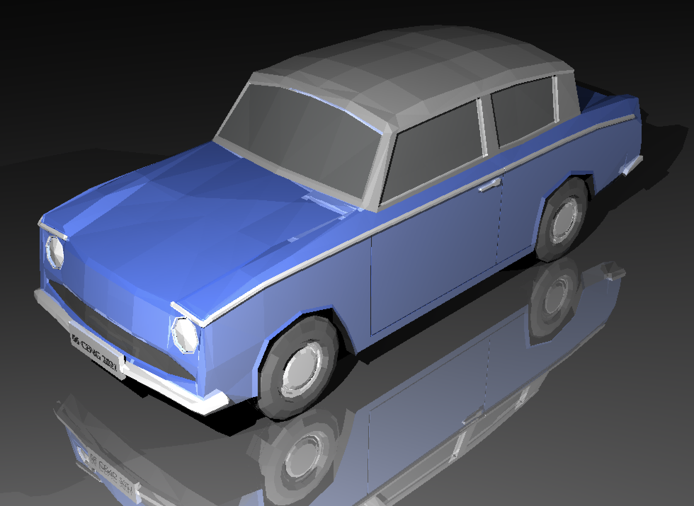
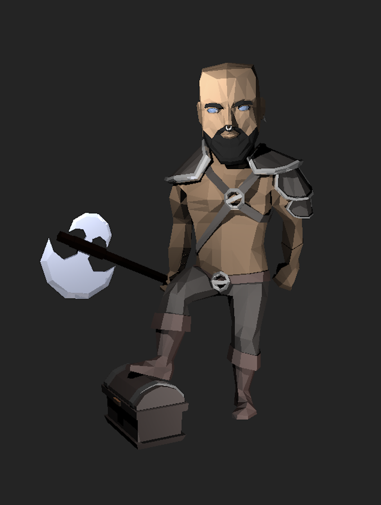
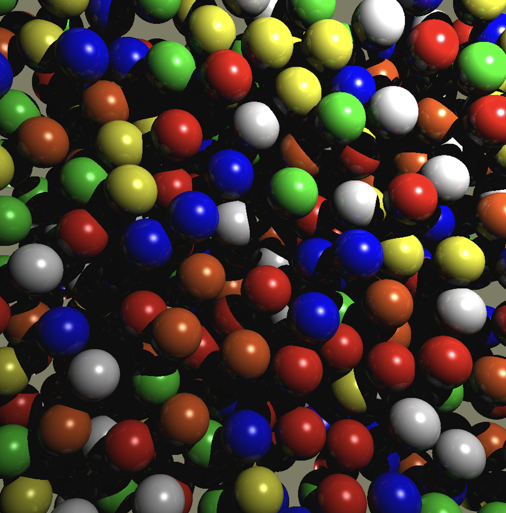
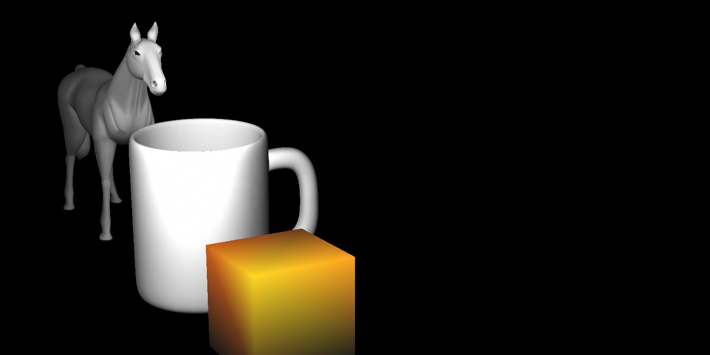
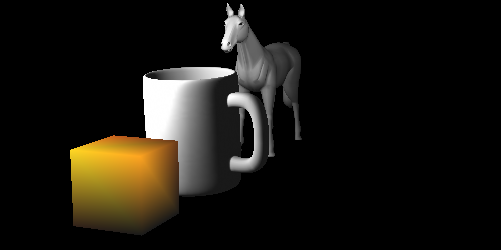
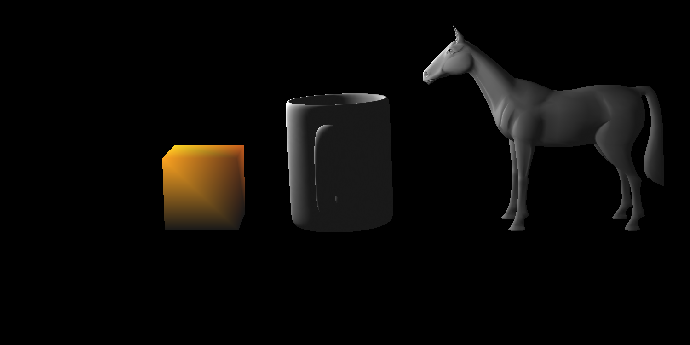

# Computer Graphics Projects Repository

<!--  |  |  -->
<p align="center">
  
&nbsp; &nbsp; &nbsp; &nbsp; 
  
&nbsp; &nbsp; &nbsp; &nbsp; 
  
</p>


## Overview
This repository is a collection of my Computer Graphics projects, demonstrating various techniques and algorithms used in the field. It includes three main projects:

1. **Ray Tracing**: A rendering technique for generating an image by tracing the path of light as pixels in an image plane, simulating effects like reflection, refraction, and shadows for a more realistic scene.
2. **Forward Rendering Pipeline**: A real-time rendering approach that processes each object in the scene, applies lighting and shading, and then rasterizes the object to produce the final image.
3. **OpenGL Bunny Game**: An interactive 3D game using OpenGL, featuring a bunny navigating through a dynamic environment with various graphical elements and effects.

Each project showcases different aspects of computer graphics, from realistic image synthesis to real-time rendering and interactive 3D applications.

---

## 1. Ray Tracing

Ray tracing is a powerful rendering technique that creates realistic images by simulating the way light interacts with objects. It traces the path of light rays as they bounce off surfaces, allowing for effects such as shadows, reflections, and refractions.

### Algorithm Summary
The ray tracing algorithm can be summarized as follows:
1. For each pixel in the image, generate a ray from the eye (camera) through the pixel.
2. For each ray, determine the closest object it intersects with in the scene.
3. Calculate the color of the intersection point using shading models, taking into account lights, material properties, and any other relevant effects (e.g., reflections, refractions).
4. Repeat the process for a specified number of reflections and refractions to simulate realistic interactions of light with objects.

### Pseudocode
```cpp
// Assume we have classes for Ray, Scene, and Camera, and functions like intersect() and computeColor()

for each pixel in the image {
    Ray ray = camera.generateRay(pixel);
    Color color = traceRay(ray, scene, depth);
    setPixelColor(pixel, color);
}

Color traceRay(Ray ray, Scene scene, int depth) {
    if (depth == 0) return backgroundColor;
    Intersection intersection = scene.intersect(ray);
    if (intersection.hit) {
        return computeColor(intersection, scene, depth);
    } else {
        return backgroundColor;
    }
}

// computeColor() includes lighting calculations, reflection/refraction handling, etc.
```

### Project Showcase
<p align="center">
  
&nbsp; &nbsp; &nbsp; &nbsp; 
  
&nbsp; &nbsp; &nbsp; &nbsp; 
  
&nbsp; &nbsp; &nbsp; &nbsp; 
</p>

---

## 2. Forward Rendering Pipeline

The Forward Rendering Pipeline is a technique used in real-time graphics to render scenes. It processes each object in the scene, applies lighting and shading, and then rasterizes the object to produce the final image.

### Algorithm Summary
The forward rendering process involves several key steps:
1. **Application Stage**: The application sends vertex data to the graphics pipeline, setting up the scene.
2. **Geometry Processing**: Vertices are transformed to screen space, and lighting calculations are performed per vertex.
3. **Rasterization**: Transformed vertices are converted into fragments.
4. **Fragment Processing**: Textures and lighting are applied to fragments to compute the final color.
5. **Output Merger**: Fragments are written to the frame buffer, producing the final image.

### Pseudocode
```cpp

for each object in the scene {
    for each vertex in the object {
        transformedVertex = transformVertex(vertex);
        litVertex = applyLighting(transformedVertex);
        rasterize(litVertex);
    }
}

for each fragment {
    color = applyTexturesAndShading(fragment);
    writeToFrameBuffer(color);
}
```

### Project Showcase
<p align="center">
  
&nbsp; &nbsp; &nbsp; &nbsp; 
  
&nbsp; &nbsp; &nbsp; &nbsp; 
<br></br>

&nbsp; &nbsp; &nbsp; &nbsp; 

&nbsp; &nbsp; &nbsp; &nbsp; 

</p>

---

## 3. OpenGL Bunny Game

This project is an interactive 3D game developed using OpenGL. It features a bunny navigating through a dynamic environment, showcasing real-time rendering techniques, collision detection, and user interaction.

### Algorithm Summary
The game's main loop includes:
1. Processing user inputs to control the bunny's movements.
2. Updating the game state based on physics and interactions.
3. Rendering the scene using OpenGL, including the bunny, environment, and any dynamic effects.

### Pseudocode
Due to the complexity of the game, a simplified overview of the main loop is provided:

```cpp

initializeGame();

while (gameRunning) {
    processInput();
    updateGameState();
    renderScene();
}

cleanup();
```

In `renderScene()`, OpenGL functions are used to draw the bunny and the environment, applying textures, lighting, and other effects to create an immersive experience.

### Project Showcase

